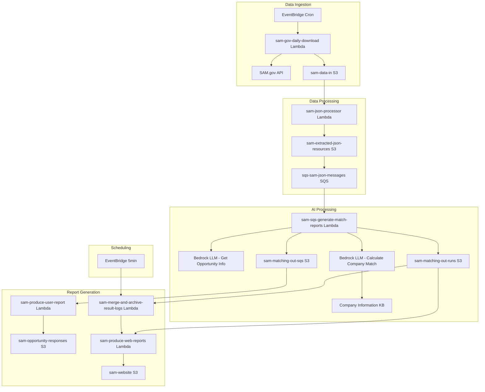

# Design Document

## Overview

The AI-powered RFP Response Agent is a serverless, event-driven data processing pipeline built on AWS that automatically processes government contracting opportunities from SAM.gov. The system uses a microservices architecture with Lambda functions, S3 for storage, SQS for message queuing, and AWS Bedrock for AI-powered opportunity matching.

The architecture follows AWS Well-Architected Framework principles, emphasizing reliability, security, performance efficiency, and cost optimization. The system processes opportunities through multiple stages: data retrieval, processing, AI analysis, result generation, and reporting.

## Architecture

### High-Level Architecture



### Data Flow Architecture

1. **Ingestion Layer**: EventBridge triggers daily SAM.gov data retrieval
2. **Processing Layer**: S3 events trigger opportunity splitting and SQS queuing
3. **AI Layer**: SQS triggers Bedrock AI processing with knowledge base integration
4. **Storage Layer**: Results stored in organized S3 structure with date-based partitioning
5. **Reporting Layer**: Event-driven report generation for both user documents and web dashboards

## Components and Interfaces

### IAM Roles

#### SamJsonProcessorRole
- **Purpose**: IAM role for sam-json-processor Lambda function
- **Permissions**: S3 read/write access to source and destination buckets, CloudWatch logs
- **Trust Policy**: Lambda service principal
- **Managed Policies**: AWSLambdaBasicExecutionRole
- **Custom Policies**: S3 bucket-specific read/write permissions

### Lambda Functions

#### sam-gov-daily-download
- **Purpose**: Retrieve daily opportunities from SAM.gov API
- **Trigger**: EventBridge cron (daily)
- **Runtime**: Python 3.11
- **Memory**: 512 MB
- **Timeout**: 15 minutes
- **Environment Variables**:
  - `SAM_API_URL`: https://api.sam.gov/prod/opportunities/v2/search
  - `SAM_API_KEY`: API key for SAM.gov access
  - `OUTPUT_BUCKET`: sam-data-in
  - `LOG_BUCKET`: sam-download-files-logs
  - `API_LIMIT`: 1000 (max records the SAM API can return)
  - `OVERRIDE_DATE_FORMAT`: MM/DD/YYYY (If _From and _to are populated, allows for custom date span to be passed to SAM API, instead of the default which is to retrieve data from the previous day)
  - `OVERRIDE_POSTED_FROM`: Custom start date override
  - `OVERRIDE_POSTED_TO`: Custom end date override
- **IAM Permissions**: S3 write, CloudWatch logs
- **Error Handling**: Exponential backoff with 1 retry, detailed logging

#### sam-json-processor
- **Purpose**: Split opportunity JSON into individual files and download resources
- **Trigger**: S3 PUT event on sam-data-in bucket
- **Runtime**: Python 3.11
- **Memory**: 2048 MB
- **Ephemeral Storage**: 1024 MB
- **Timeout**: 10 minutes
- **Environment Variables**:
  - `OUTPUT_BUCKET`: sam-extracted-json-resources
  - `MAX_CONCURRENT_DOWNLOADS`: 10
- **IAM Role**: SamJsonProcessorRole
- **IAM Permissions**: S3 read/write, CloudWatch logs
- **Error Handling**: Continue processing on individual failures, log errors

#### sam-sqs-generate-match-reports
- **Purpose**: Process opportunities through Bedrock AI for matching
- **Trigger**: SQS sqs-sam-json-messages
- **Runtime**: Python 3.11
- **Memory**: 2048 MB
- **Timeout**: 5 minutes
- **Batch Size**: 1
- **Concurrency**: Configurable (1-10)
- **Environment Variables**:
  - `BEDROCK_REGION`: us-east-1
  - `KNOWLEDGE_BASE_ID`: Company Information KB ID
  - `MATCH_THRESHOLD`: 0.7
  - `OUTPUT_BUCKET_SQS`: sam-matching-out-sqs
  - `OUTPUT_BUCKET_RUNS`: sam-matching-out-runs
  - `MAX_ATTACHMENT_FILES`: 4 (limits on how many files are processed per opportunity)
  - `MAX_DESCRIPTION_CHARS`: 20000 (restrict the number of tokens for descriptions)
  - `MAX_ATTACHMENT_CHARS`: 16000 (restrict the number of tokens for attachments)
  - `MODEL_ID_DESC`: Model ID for extracting opportunity descriptions
  - `MODEL_ID_MATCH`: Model ID for matching opportunity to KB data
  - `DEBUG_MODE`: true (debug flag)
  - `PROCESS_DELAY_SECONDS`: 60 (used to prevent too many requests threshold being hit on LLM requests)
- **IAM Permissions**: Bedrock invoke, S3 read/write, SQS receive/delete
- **Error Handling**: Dead letter queue after 3 retries

#### sam-produce-user-report
- **Purpose**: Generate readable reports and email templates
- **Trigger**: S3 PUT event on sam-matching-out-sqs bucket
- **Runtime**: Python 3.11
- **Memory**: 1024 MB
- **Timeout**: 3 minutes
- **Environment Variables**:
  - `OUTPUT_BUCKET`: sam-opportunity-responses
  - `COMPANY_NAME`: Company name for templates
  - `COMPANY_CONTACT`: Contact information
- **IAM Permissions**: S3 read/write, CloudWatch logs
- **Dependencies**: python-docx library for Word document generation

#### sam-merge-and-archive-result-logs
- **Purpose**: Aggregate run results and archive individual files
- **Trigger**: EventBridge (every 5 minutes)
- **Runtime**: Python 3.11
- **Memory**: 128 MB
- **Ephemeral Storage**: 512 MB
- **Timeout**: 5 minutes
- **Environment Variables**:
  - `RUNS_BUCKET`: sam-matching-out-runs
  - `ARCHIVE_FOLDER`: archive
- **IAM Permissions**: S3 read/write/delete, CloudWatch logs

#### sam-produce-web-reports
- **Purpose**: Generate daily web dashboard
- **Trigger**: S3 PUT event on sam-matching-out-runs/runs/ with pattern "2*.json"
- **Runtime**: Python 3.11
- **Memory**: 1024 MB
- **Timeout**: 5 minutes
- **Environment Variables**:
  - `WEBSITE_BUCKET`: sam-website
  - `DASHBOARD_PATH`: dashboards/
- **IAM Permissions**: S3 read/write, CloudWatch logs

### S3 Buckets

#### sam-data-in
- **Purpose**: Store raw SAM.gov API responses
- **Versioning**: Enabled
- **Encryption**: AES-256
- **Lifecycle**: Delete after 30 days
- **Event Notifications**: Trigger sam-json-processor on PUT

#### sam-extracted-json-resources
- **Purpose**: Store individual opportunity files and resources
- **Structure**: `/{opportunity_number}/opportunity.json` and resource files
- **Versioning**: Disabled
- **Encryption**: AES-256
- **Lifecycle**: Move to IA after 30 days, delete after 90 days
- **Event Notifications**: Trigger SQS message on PUT

#### sam-matching-out-sqs
- **Purpose**: Store categorized match results
- **Structure**: 
  - `/YYYY-MM-DD/matches/{solicitation_id}.json`
  - `/YYYY-MM-DD/no_matches/{solicitation_id}.json`
  - `/YYYY-MM-DD/errors/{solicitation_id}.json`
- **Versioning**: Disabled
- **Encryption**: AES-256
- **Event Notifications**: Trigger sam-produce-user-report on PUT

#### sam-matching-out-runs
- **Purpose**: Store run summaries and aggregated results
- **Structure**: 
  - `/runs/YYYYMMDDtHHMMZ.json` (aggregated)
  - `/archive/` (archived individual runs)
- **Versioning**: Enabled
- **Encryption**: AES-256
- **Event Notifications**: Trigger sam-produce-web-reports on PUT to runs/

#### sam-opportunity-responses
- **Purpose**: Store generated user reports
- **Structure**: `/{solicitation_id}/report.txt` and `/{solicitation_id}/report.docx`
- **Versioning**: Enabled
- **Encryption**: AES-256

#### sam-website
- **Purpose**: Host static website with dashboards
- **Structure**: `/dashboards/Summary_YYYYMMDD.html`
- **Static Website Hosting**: Enabled
- **Public Read Access**: Enabled for website content

#### sam-company-info
- **Purpose**: Store company information for knowledge base
- **Versioning**: Enabled
- **Encryption**: AES-256
- **Integration**: Bedrock Knowledge Base data source

### SQS Queue

#### sqs-sam-json-messages
- **Type**: Standard Queue
- **Visibility Timeout**: 5 minutes
- **Message Retention**: 14 days
- **Dead Letter Queue**: Enabled (3 retries)
- **Encryption**: SQS-managed encryption
- **Batch Size**: 1 message per Lambda invocation

### Bedrock Components

#### Company Information KB
- **Type**: Knowledge Base with S3 vector store
- **Data Source**: sam-company-info S3 bucket
- **Vector Store**: Amazon OpenSearch Serverless
- **Embedding Model**: amazon.titan-embed-text-v1
- **Chunking Strategy**: Default (300 tokens, 20% overlap)
- **Sync Schedule**: Daily

#### LLM Models
- **Get Opportunity Info**: anthropic.claude-3-sonnet-20240229-v1:0
- **Calculate Company Match**: anthropic.claude-3-sonnet-20240229-v1:0
- **Max Tokens**: 4000
- **Temperature**: 0.1 for consistency

## Data Models

### SAM Opportunity JSON Structure
```json
{
  "opportunity_id": "string",
  "solicitation_number": "string",
  "title": "string",
  "description": "string",
  "posted_date": "ISO 8601 date",
  "response_deadline": "ISO 8601 date",
  "naics_codes": ["string"],
  "set_aside_codes": ["string"],
  "place_of_performance": {
    "city": "string",
    "state": "string",
    "country": "string"
  },
  "point_of_contact": {
    "name": "string",
    "email": "string",
    "phone": "string"
  },
  "resource_links": ["string"]
}
```

### Match Result JSON Structure
```json
{
  "solicitation_id": "string",
  "processed_timestamp": "ISO 8601 date",
  "match_threshold": "float",
  "is_match": "boolean",
  "match_score": "float (0.0-1.0)",
  "rationale": "string (6-10 sentences, or 'No relevant information found.')",
  "citations": [
    {
      "document_title": "string",
      "section_or_page": "string",
      "excerpt": "string"
    }
  ],
  "opportunity_required_skills": ["string"],
  "company_skills": ["string"],
  "past_performance": ["string"],
  "opportunity_summary": {
    "title": "string",
    "value": "string",
    "deadline": "ISO 8601 date",
    "naics_codes": ["string"]
  }
}
```

### Run Summary JSON Structure
```json
{
  "run_id": "string",
  "timestamp": "ISO 8601 date",
  "date_prefix": "YYYYMMDD",
  "total_opportunities": "integer",
  "matches_found": "integer",
  "no_matches": "integer",
  "errors": "integer",
  "processing_time_seconds": "integer",
  "top_matches": [
    {
      "solicitation_id": "string",
      "match_score": "float",
      "title": "string"
    }
  ]
}
```

## Error Handling

### Retry Strategies
- **API Calls**: Exponential backoff with jitter, 1 retry maximum
- **S3 Operations**: Built-in AWS SDK retry with exponential backoff
- **SQS Processing**: Dead letter queue after 3 attempts
- **Bedrock Calls**: Exponential backoff with circuit breaker pattern

### Error Categories
1. **Transient Errors**: Network timeouts, service throttling
2. **Data Errors**: Malformed JSON, missing required fields
3. **Business Logic Errors**: Invalid opportunity data, processing failures
4. **System Errors**: Lambda timeouts, memory limits

### Monitoring and Alerting
- **CloudWatch Metrics**: Custom metrics for processing rates, error rates, match scores
- **CloudWatch Alarms**: Alert on high error rates, processing delays
- **X-Ray Tracing**: End-to-end request tracing for debugging
- **Structured Logging**: JSON logs with correlation IDs

## Testing Strategy

### Unit Testing
- **Lambda Functions**: pytest with moto for AWS service mocking
- **Business Logic**: Isolated testing of matching algorithms
- **Data Validation**: Schema validation testing
- **Error Handling**: Exception path testing

### Integration Testing
- **S3 Event Processing**: End-to-end file processing workflows
- **SQS Message Processing**: Queue integration testing
- **Bedrock Integration**: AI model response validation
- **API Integration**: SAM.gov API response handling

### Performance Testing
- **Load Testing**: Simulate high-volume opportunity processing
- **Concurrency Testing**: Validate SQS batch processing limits
- **Memory Profiling**: Optimize Lambda memory allocation
- **Timeout Testing**: Validate processing time limits

### Security Testing
- **IAM Policy Validation**: Least privilege access testing
- **Data Encryption**: Verify encryption at rest and in transit
- **API Security**: Validate secure API communications
- **Input Validation**: Test against malicious input data

## Security Considerations

### Data Protection
- **Encryption at Rest**: All S3 buckets use AES-256 encryption
- **Encryption in Transit**: HTTPS for all API calls, TLS for internal communications
- **Key Management**: AWS KMS for encryption key management
- **Data Classification**: Separate handling for sensitive company information

### Access Control
- **IAM Roles**: Function-specific roles with minimal permissions
- **Resource-Based Policies**: S3 bucket policies for cross-service access
- **VPC Configuration**: Lambda functions in private subnets where needed
- **API Authentication**: Secure API key management for SAM.gov

### Compliance
- **Audit Logging**: CloudTrail for all API calls
- **Data Retention**: Automated lifecycle policies for data cleanup
- **Privacy**: No PII storage in logs or temporary files
- **Monitoring**: Real-time security event monitoring

## Performance Optimization

### Scalability
- **Auto Scaling**: Lambda concurrency limits based on downstream capacity
- **Batch Processing**: Optimized batch sizes for SQS processing
- **Parallel Processing**: Concurrent opportunity processing where possible
- **Resource Allocation**: Right-sized Lambda memory and timeout settings

### Cost Optimization
- **S3 Storage Classes**: Intelligent tiering for cost optimization
- **Lambda Provisioned Concurrency**: Only for critical functions
- **Bedrock Model Selection**: Cost-effective model choices for each use case
- **Resource Cleanup**: Automated cleanup of temporary resources

### Monitoring
- **Performance Metrics**: Processing time, throughput, error rates
- **Cost Tracking**: Resource usage and cost allocation
- **Capacity Planning**: Predictive scaling based on historical data
- **Health Checks**: Automated system health monitoring