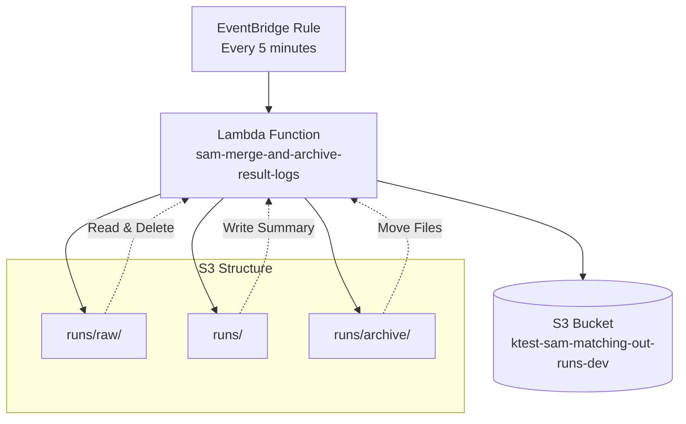

# Design Document

## Overview

The EventBridge Log Merger feature integrates an existing Lambda function into the current AWS infrastructure to automatically merge and archive result logs from S3 every 5 minutes. The solution leverages the existing EventBridge rules template and Lambda functions template patterns to deploy the function with proper IAM permissions and environment configuration.

The Lambda function processes files from the `runs/raw/` S3 prefix, merges them into timestamped summary files, and moves processed files to the `runs/archive/` prefix. This ensures efficient log management and prevents accumulation of raw log files.

## Architecture

### High-Level Architecture



### Component Integration

The solution integrates with the existing infrastructure:

1. **EventBridge Rules Template**: Already contains the `SamLambdaEvery5MinSummarizerRule` configured for 5-minute intervals
2. **Lambda Functions Template**: Already contains the `SamMergeAndArchiveResultLogsFunction` with placeholder code
3. **IAM Roles**: The `SamMergeAndArchiveResultLogsRole` already has appropriate S3 permissions
4. **S3 Bucket**: Uses the existing `sam-matching-out-runs-dev` bucket (with optional prefix support)

## Components and Interfaces

### Lambda Function Component

**Function Name**: `sam-merge-and-archive-result-logs-{environment}`
**Runtime**: Python 3.11
**Memory**: 128 MB
**Timeout**: 5 minutes
**Handler**: `lambda_function.lambda_handler`

**Environment Variables**:
- `S3_OUT_BUCKET`: Target S3 bucket name (ktest-sam-matching-out-runs-dev)
- `active`: Set to "true" to enable processing

**Key Methods**:
- `get_last_complete_bucket()`: Calculates the 5-minute time window for processing
- `list_s3_keys()`: Paginates through S3 objects with given prefix
- `lambda_handler()`: Main entry point that orchestrates the merge and archive process

### EventBridge Integration

**Rule Name**: `sam-lambda-every-5min-summarizer-{environment}`
**Schedule**: `rate(5 minutes)`
**State**: ENABLED
**Target**: Lambda function ARN

### IAM Role and Permissions

**Role Name**: `SamMergeAndArchiveResultLogsRole`

**Required Permissions**:
- `s3:GetObject`: Read files from runs/raw/ prefix
- `s3:PutObject`: Write summary files to runs/ prefix
- `s3:DeleteObject`: Remove processed files from runs/raw/
- `s3:ListBucket`: List objects in the bucket
- Basic Lambda execution permissions via `AWSLambdaBasicExecutionRole`
- X-Ray tracing permissions via `AWSXRayDaemonWriteAccess`

### S3 Bucket Structure

**Bucket**: `{BucketPrefix}-sam-matching-out-runs-{Environment}`

**Directory Structure**:
```
runs/
├── raw/                    # Input files to be processed
├── archive/               # Processed files moved here
└── {YYYYMMDDTHHMM}Z.json # Summary files (timestamped)
```

## Data Models

### Input Data Model

**Raw Log Files** (from `runs/raw/`):
- Format: JSON objects
- Location: S3 bucket with `runs/raw/` prefix
- Processing criteria: Files modified within the last 5-minute time bucket
- Action: Read, parse, and include in summary

### Output Data Model

**Summary File** (`runs/{timestamp}Z.json`):
```json
[
  {
    // Merged JSON record from raw file 1
  },
  {
    // Merged JSON record from raw file 2
  }
  // ... additional records
]
```

**Archive Files** (`runs/archive/{filename}`):
- Original raw files moved after successful processing
- Maintains original filename
- Preserves file content and metadata

### Processing Logic

**Time Window Calculation**:
- Uses 5-minute buckets aligned to clock boundaries (e.g., 10:00, 10:05, 10:10)
- Processes files modified in the previous complete 5-minute window
- Ensures no future files are processed

**File Processing Flow**:
1. Calculate the last complete 5-minute time bucket
2. List all files in `runs/raw/` prefix
3. Filter files by modification time within the time bucket
4. Read and parse each JSON file
5. Aggregate all valid JSON records into a summary array
6. Write summary to timestamped file in `runs/` prefix
7. Move processed files to `runs/archive/` prefix
8. Delete original files from `runs/raw/` prefix

## Error Handling

### File Processing Errors

**JSON Parse Failures**:
- Invalid JSON files are skipped silently
- Processing continues with remaining valid files
- No error thrown to prevent function failure

**S3 Operation Failures**:
- Individual file operation failures don't stop batch processing
- Function logs errors but continues processing other files
- Uses boto3 client error handling for retries

### Function-Level Error Handling

**Inactive Mode**:
- When `active` environment variable is not "true"
- Function returns early with inactive status
- No processing occurs, preventing accidental execution

**Empty Result Sets**:
- When no files match the time window criteria
- Function logs the condition and returns successfully
- No summary file is created for empty batches

### Monitoring and Logging

**CloudWatch Logs**:
- Structured logging for processing statistics
- Error logging for troubleshooting
- Performance metrics for optimization

**Function Response**:
```json
{
  "processed": 5,
  "archived": 5,
  "summary_key": "runs/20241010T1045Z.json"
}
```

## Testing Strategy

### Unit Testing Approach

**Time Window Logic Testing**:
- Test `get_last_complete_bucket()` with various timestamps
- Verify correct 5-minute boundary calculations
- Test edge cases around hour and day boundaries

**S3 Integration Testing**:
- Mock S3 client operations for isolated testing
- Test file listing, reading, writing, and deletion operations
- Verify error handling for S3 operation failures

**JSON Processing Testing**:
- Test valid JSON file processing
- Test invalid JSON file handling (graceful skipping)
- Test empty file scenarios

### Integration Testing Approach

**End-to-End Processing**:
- Create test files in `runs/raw/` with known timestamps
- Trigger Lambda function manually
- Verify summary file creation and archive operations
- Validate file content and structure

**EventBridge Integration**:
- Test scheduled execution via EventBridge
- Verify function is triggered at correct intervals
- Monitor CloudWatch logs for successful executions

### Performance Testing

**Load Testing**:
- Test with varying numbers of files (1, 10, 100, 1000)
- Measure execution time and memory usage
- Verify function completes within timeout limits

**Concurrency Testing**:
- Test multiple simultaneous executions
- Verify no race conditions in file processing
- Ensure proper handling of overlapping time windows

## Deployment Integration

### CloudFormation Template Updates

**Lambda Function Code Deployment**:
- Replace placeholder code in `SamMergeAndArchiveResultLogsFunction`
- Update environment variables to use correct S3 bucket name
- Ensure proper IAM role association

**Environment Variable Configuration**:
- Set `S3_OUT_BUCKET` to `ktest-sam-matching-out-runs-dev`
- Set `active` to `true` to enable processing
- Maintain existing X-Ray tracing configuration

### Deployment Process

**Code Packaging**:
- Package Lambda function code into deployment ZIP
- Include all necessary dependencies
- Maintain Python 3.11 runtime compatibility

**Infrastructure Updates**:
- Update existing CloudFormation stack
- Deploy Lambda function code via CloudFormation
- Verify EventBridge rule is enabled and properly configured

**Post-Deployment Verification**:
- Test manual Lambda invocation
- Verify EventBridge scheduled execution
- Monitor initial processing cycles for correctness