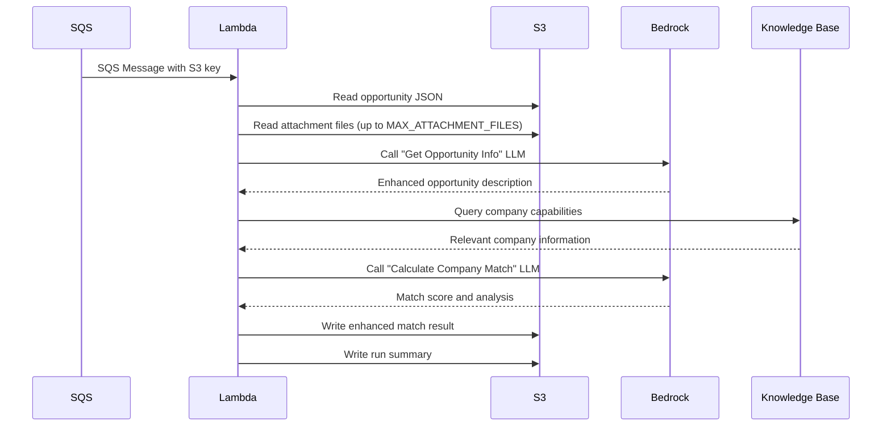

# Design Document

## Overview

This design document outlines the implementation approach for updating the sam-sqs-generate-match-reports Lambda function to replace hardcoded debug output with real AWS Bedrock LLM-based opportunity analysis. The solution will integrate with existing AWS services including Bedrock Knowledge Base, S3, and SQS while maintaining backward compatibility with downstream systems.

The updated function will process opportunity data through two main LLM calls: first to extract and enhance opportunity information, then to calculate match scores against company capabilities stored in the Bedrock Knowledge Base. The output will include comprehensive opportunity metadata, match analysis, and knowledge base citations.

## Architecture

### Current vs. New Architecture

```mermaid
graph TB
    subgraph "Current (Debug) Flow"
        A1[SQS Message] --> B1[Lambda Handler]
        B1 --> C1[Hardcoded Test Data]
        C1 --> D1[S3 Output]
    end
    
    subgraph "New (LLM) Flow"
        A2[SQS Message] --> B2[Lambda Handler]
        B2 --> C2[Read S3 Opportunity Data]
        C2 --> D2[Extract Opportunity Info LLM]
        D2 --> E2[Calculate Match LLM]
        E2 --> F2[Query Knowledge Base]
        F2 --> G2[Generate Enhanced Output]
        G2 --> H2[S3 Output]
    end
```



### LLM Processing Flow



## Components and Interfaces

### Lambda Function Structure

#### Main Handler Function
- **Purpose**: Process SQS messages and orchestrate LLM calls
- **Input**: SQS event with S3 object references
- **Output**: Enhanced match results and run summaries
- **Error Handling**: Comprehensive logging and error categorization

#### Opportunity Data Reader
- **Purpose**: Read and parse opportunity JSON and attachment files
- **Input**: S3 bucket and key from SQS message
- **Output**: Structured opportunity data with attachments
- **Constraints**: Respect MAX_ATTACHMENT_FILES and character limits

#### LLM Service Interface
- **Purpose**: Abstract Bedrock LLM interactions
- **Methods**: 
  - `extract_opportunity_info(opportunity_data, attachments)`
  - `calculate_company_match(opportunity_info, kb_results)`
- **Error Handling**: Retry logic with exponential backoff
- **Rate Limiting**: Implement PROCESS_DELAY_SECONDS

#### Knowledge Base Query Service
- **Purpose**: Query Bedrock Knowledge Base for company information
- **Input**: Opportunity requirements and skills
- **Output**: Relevant company capabilities with citations
- **Caching**: Consider caching frequent queries

### Data Processing Pipeline

#### Stage 1: Data Extraction
```python
def extract_opportunity_data(s3_key):
    """
    Extract opportunity data from S3 including:
    - Main opportunity JSON
    - Associated attachment files (limited by MAX_ATTACHMENT_FILES)
    - Truncate content based on MAX_DESCRIPTION_CHARS and MAX_ATTACHMENT_CHARS
    """
```

#### Stage 2: Opportunity Enhancement
```python
def enhance_opportunity_description(opportunity_data, attachments):
    """
    Call Bedrock LLM to create enhanced_description with:
    - Business Summary (Purpose, Unique Info, Work Description, Technical Requirements)
    - Non-Technical Summary (Clearances, Evaluation, Security, Compliance)
    - Extracted skills and requirements
    """
```

#### Stage 3: Company Matching
```python
def calculate_company_match(enhanced_opportunity, kb_results):
    """
    Call Bedrock LLM to:
    - Analyze opportunity requirements against company capabilities
    - Generate match score (0.0-1.0)
    - Provide detailed rationale
    - Identify skill gaps and strengths
    """
```

### Environment Variables Integration

The function will use existing environment variables:
- `BEDROCK_REGION`: AWS region for Bedrock services
- `KNOWLEDGE_BASE_ID`: Company Information KB identifier
- `MATCH_THRESHOLD`: Score threshold for categorization
- `MODEL_ID_DESC`: Model for opportunity description enhancement
- `MODEL_ID_MATCH`: Model for match calculation
- `MAX_ATTACHMENT_FILES`: Limit attachment processing
- `MAX_DESCRIPTION_CHARS`: Truncate opportunity descriptions
- `MAX_ATTACHMENT_CHARS`: Truncate attachment content
- `PROCESS_DELAY_SECONDS`: Rate limiting delay
- `DEBUG_MODE`: Enable detailed logging

## Data Models

### Enhanced Match Result Structure
```json
{
  "solicitationNumber": "string",
  "noticeId": "string", 
  "title": "string",
  "fullParentPathName": "string",
  "enhanced_description": "string (structured with Business Summary and Non-Technical Summary)",
  "score": "float (0.0-1.0)",
  "rationale": "string (detailed analysis)",
  "opportunity_required_skills": ["string"],
  "company_skills": ["string"],
  "past_performance": ["string"],
  "citations": [
    {
      "document_title": "string",
      "section_or_page": "string", 
      "excerpt": "string"
    }
  ],
  "kb_retrieval_results": [
    {
      "index": "integer",
      "title": "string",
      "snippet": "string",
      "source": "string",
      "metadata": "object",
      "location": "object"
    }
  ],
  "input_key": "string",
  "timestamp": "ISO 8601 date",
  "postedDate": "string",
  "type": "string",
  "responseDeadLine": "ISO 8601 date",
  "pointOfContact.fullName": "string",
  "pointOfContact.email": "string", 
  "pointOfContact.phone": "string",
  "placeOfPerformance.city.name": "string",
  "placeOfPerformance.state.name": "string",
  "placeOfPerformance.country.name": "string",
  "uiLink": "string"
}
```

### LLM Prompt Templates

#### Opportunity Enhancement Prompt
```
Analyze the following government contracting opportunity and create an enhanced description.

Opportunity Data: {opportunity_json}
Attachments: {attachment_content}

Please provide a structured response with:
1. Business Summary
   - Purpose of the Solicitation
   - Information Unique to the Project  
   - Overall Description of the Work
   - Technical Capabilities, Specific Skills, or Experience Required

2. Non-Technical Summary
   - Clearances Information
   - Technical Proposal Evaluation
   - Security requirements
   - Compliance requirements

Extract key skills and requirements as a list.
```

#### Company Match Prompt
```
Analyze how well our company matches this opportunity based on our capabilities.

Enhanced Opportunity: {enhanced_description}
Company Capabilities: {kb_results}

Provide:
1. Match score (0.0-1.0)
2. Detailed rationale explaining strengths, gaps, and overall assessment
3. List of opportunity required skills
4. List of relevant company skills
5. Past performance examples if applicable

Be specific about capability alignment and any gaps.
```

## Error Handling

### Error Categories and Responses

#### Data Access Errors
- **S3 Read Failures**: Log bucket/key details, continue with available data
- **JSON Parse Errors**: Log malformed data, create error record
- **Missing Files**: Log missing attachments, process with available data

#### LLM Processing Errors
- **Rate Limiting**: Implement exponential backoff with PROCESS_DELAY_SECONDS
- **Model Errors**: Log model responses, retry with simplified prompts
- **Timeout Errors**: Log processing time, create partial results if possible

#### Knowledge Base Errors
- **Query Failures**: Log query parameters, continue with empty KB results
- **Connection Issues**: Implement retry logic, fallback to basic matching

### Retry Strategy
```python
def retry_with_backoff(func, max_retries=3, base_delay=1):
    """
    Exponential backoff retry logic for LLM calls
    - Initial delay: base_delay seconds
    - Exponential increase: delay *= 2
    - Maximum retries: max_retries
    """
```

### Error Output Format
```json
{
  "solicitationNumber": "extracted_if_possible",
  "error": "error_description",
  "error_type": "data_access|llm_processing|knowledge_base",
  "timestamp": "ISO 8601 date",
  "input_key": "original_s3_key",
  "processing_stage": "data_extraction|opportunity_enhancement|match_calculation"
}
```

## Testing Strategy

### Unit Testing
- **Data Extraction**: Test S3 reading with various file formats
- **LLM Integration**: Mock Bedrock responses for consistent testing
- **Knowledge Base Queries**: Test query formatting and response parsing
- **Error Handling**: Test all error scenarios and retry logic

### Integration Testing
- **End-to-End Processing**: Test complete SQS message processing
- **Bedrock Integration**: Test actual LLM calls with sample data
- **S3 Output Validation**: Verify output format matches requirements
- **Performance Testing**: Validate processing times within Lambda limits

### Test Data Requirements
- **Sample Opportunities**: Various opportunity types and formats
- **Mock KB Responses**: Realistic company capability data
- **Error Scenarios**: Malformed data, missing files, API failures
- **Edge Cases**: Large attachments, special characters, empty responses

## Performance Optimization

### Processing Efficiency
- **Parallel Processing**: Process attachments concurrently where possible
- **Content Truncation**: Implement smart truncation preserving key information
- **Caching**: Cache frequent KB queries to reduce API calls
- **Batch Operations**: Optimize S3 operations for multiple file reads

### Memory Management
- **Streaming**: Stream large files instead of loading entirely in memory
- **Cleanup**: Explicitly clean up temporary data structures
- **Monitoring**: Track memory usage patterns for optimization

### Cost Optimization
- **Model Selection**: Use appropriate models for each task (description vs. matching)
- **Token Management**: Optimize prompts to minimize token usage
- **KB Query Efficiency**: Craft precise queries to reduce retrieval costs
- **Error Handling**: Fail fast on unrecoverable errors to avoid wasted processing

## Security Considerations

### Data Protection
- **Sensitive Information**: Ensure no sensitive data is logged in debug mode
- **Temporary Storage**: Clean up any temporary files containing opportunity data
- **API Keys**: Secure handling of any API credentials

### Access Control
- **IAM Permissions**: Maintain least privilege access to Bedrock and KB services
- **Cross-Service Access**: Validate permissions for S3, SQS, and Bedrock integration
- **Logging**: Ensure logs don't contain sensitive company or opportunity information

### Compliance
- **Data Retention**: Follow existing data lifecycle policies
- **Audit Trail**: Maintain processing logs for compliance tracking
- **Error Reporting**: Ensure error logs don't expose sensitive information